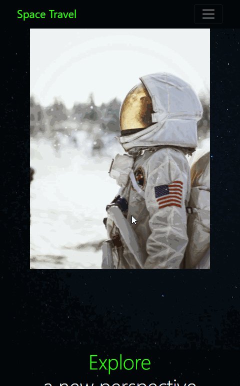

# SpaceTravel
Responsive website built using HTML, CSS, and BootStrap. The main purpose of this website was to implement features of BootStrap to increase my familiarity with this framework. This website is only for looks and UI and as a result many features included do not have the expected functionality(ex. the links).

## Video Walkthrough

Here's two walkthroughs of implemented user stories:

### Landscape Mode:

### Portrait Mode:

